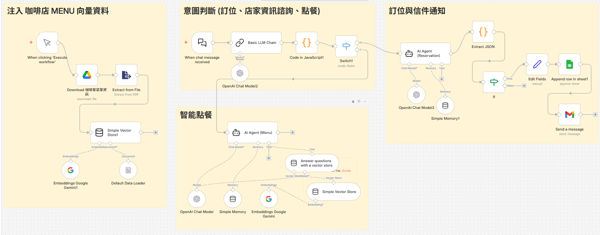
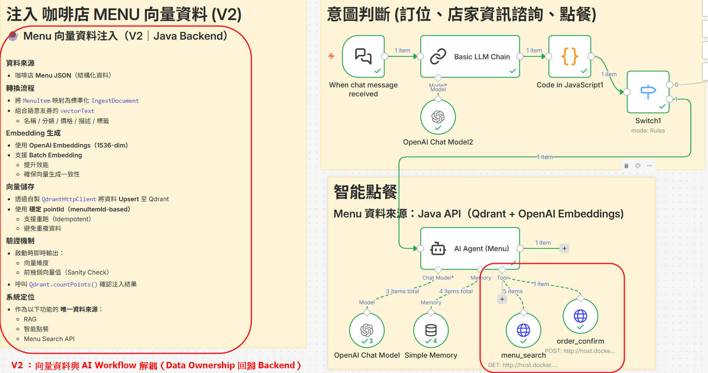

# AI 咖啡店智能助理（AI Coffee Shop Agent）
- 結合 **AI Agent、RAG（Retrieval-Augmented Generation）** 與 **Tool Calling**
---

## 🔍架構演進總覽（POC → Backend）

### Phase 1 :（POC）以 **n8n 快速驗證** AI Agent 的行為與互動流程

- 使用者以自然語言互動
- AI Agent 的意圖判斷能力
- RAG（菜單知識查詢）
- Tool Calling（訂位等實際業務動作）

### Phase 2 : Java Backend + Vector DB （目前進度）

- 📚 Menu 向量資料注入
  - 使用 OpenAI Embeddings（1536-dim）
  - 自製 QdrantHttpClient 將資料 Upsert 至 Qdrant
- 🔠 向量搜尋（Qdrant）(先僅限於菜單 Menu Search + Order Confirm API)
  - 實作語意相似度搜尋（Top-K）
  - 回傳結構化菜單資料作為 AI Agent 的 唯一菜單資料來源 

## 🎯 專案目標

先以 **n8n 做 POC 驗證**，再 **逐步遷移到 Java Spring Boot 後端實作**：

- **Menu Semantic Search（RAG）**
  - Java Backend 將菜單資料向量化並存於 Qdrant
  - 提供 API 作為唯一菜單查詢介面

- **Action Execution via Tool Calling**
  - AI Agent 依使用者意圖，呼叫後端 API（如 `menuSearch`, `orderConfirm`）
  - 將「理解（AI）」與「執行（Backend）」明確分離

- **Progressive Architecture**
  - 初期以 n8n 承擔 AI Agent 決策角色
  - 架構設計可平滑遷移至純 Java-based AI Agent

---

## 🧠 核心概念（Core Concepts）

- **AI Agent**：負責理解使用者意圖與決策
- **RAG**：用向量資料庫查詢咖啡店菜單與知識
- **Tool Calling**：AI 呼叫後端 API 執行業務動作
- **AI 與業務邏輯分離**：方便未來 AI Agent 從 n8n 平滑遷移至 Java 或其他 Agent Framework。
  - 將 AI 能力限制在「決策層」：
    - AI Agent：
      - 僅負責語意理解與流程決策
      - 不直接存取資料庫、不執行業務邏輯
    - Backend Service：
      - 封裝所有資料存取與業務規則
      - 以明確 API 作為 AI 的唯一操作介面

---

## 🛠 技術規劃（Tech Stack）

### Phase 1：POC（快速驗證）
- n8n（AI Agent / RAG / Tool Workflow）
- OpenAI / OpenRouter
- n8n Vector Store
- Google Sheets（訂位資料）

### Phase 2：後端實作
- Java 17
- Spring Boot
- RESTful API
- Vector DB（Qdrant）
- OpenAI Embeddings
- Docker（Qdrant / n8n）

---

## 下一步計畫（Future Work）

**逐步將 Agent Runtime 收斂至 Java Backend，實作由 LLM 決策工具呼叫的完整 AI Agent**

規劃中的 Agent 能力包含：
- 接收使用者自然語言輸入（User Message）
- 呼叫支援 Tool Calling 的 LLM
- 提供明確的 Tools Schema（例如：`menu_search`、`order_confirm`）
- 由 LLM 決定是否與如何呼叫對應工具
- 執行實際業務 Service（Java）
- 將執行結果回饋給 LLM，生成最終回覆

在 **現有 Java API 穩定後** 逐步導入，  確保資料一致性、業務可測試性與 Agent 行為可控。

